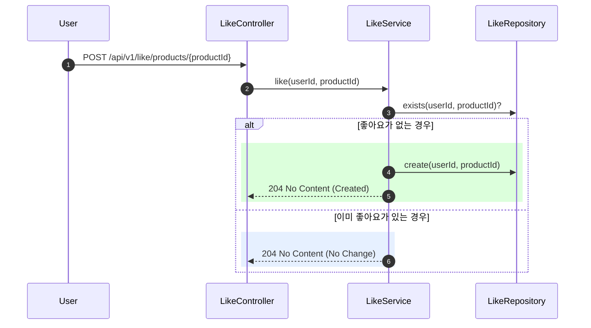
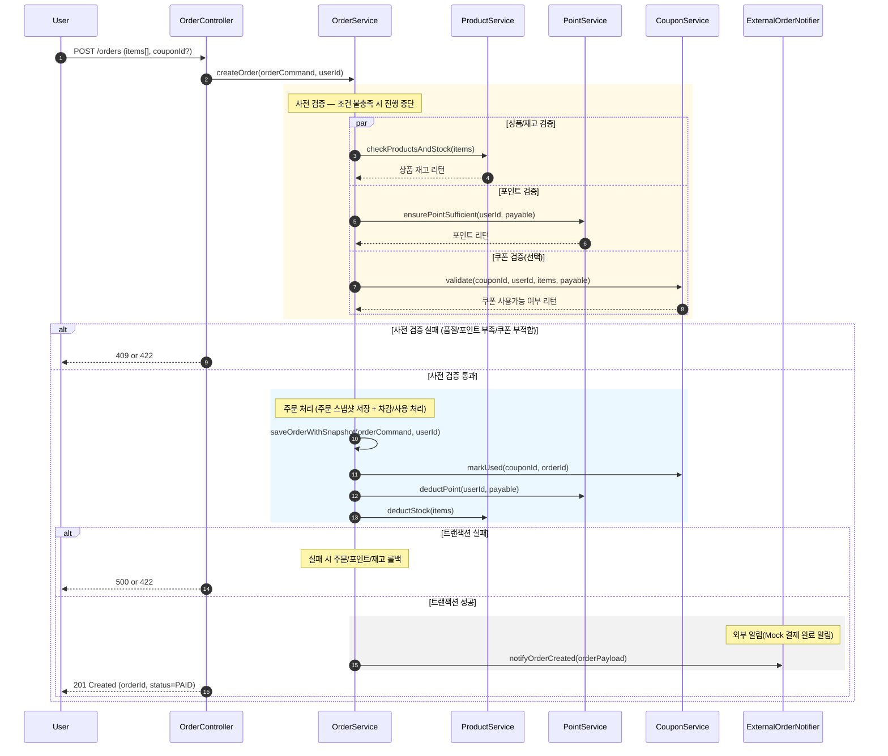

### 좋아요 추가 플로우

```mermaid
sequenceDiagram
    autonumber
    participant U as User
    participant C as LikeController
    participant S as LikeService
    participant R as LikeRepository

    U->>C: POST /api/v1/like/products/{productId}
    C->>S: like(userId, productId)
    S->>R: exists(userId, productId)?

    alt 좋아요가 없는 경우
        rect rgb(220, 255, 220)
            S->>R: create(userId, productId)
            S-->>C: 204 No Content (Created)
        end
    else 이미 좋아요가 있는 경우
        rect rgb(230, 240, 255)
            S-->>C: 204 No Content (No Change)
        end
    end
```

### 주문 생성 플로우

```mermaid
sequenceDiagram
  autonumber
  participant User
  participant OrderController
  participant OrderService
  participant ProductService      as ProductService
  participant PointService        as PointService
  participant CouponService       as CouponService
  participant ExternalOrderNotifier

  User->>OrderController: POST /orders (items[], couponId?)
  OrderController->>OrderService: createOrder(orderCommand, userId)

  rect rgb(255, 249, 230)
    note over OrderService: 사전 검증 — 조건 불충족 시 진행 중단
    par 상품/재고 검증
      OrderService->>ProductService: checkProductsAndStock(items)
      ProductService-->>OrderService: 상품 재고 리턴
    and 포인트 검증
      OrderService->>PointService: ensurePointSufficient(userId, payable)
      PointService-->>OrderService: 포인트 리턴
    and 쿠폰 검증(선택)
      OrderService->>CouponService: validate(couponId, userId, items, payable)
      CouponService-->>OrderService: 쿠폰 사용가능 여부 리턴
    end
  end

  alt 사전 검증 실패 (품절/포인트 부족/쿠폰 부적합)
    OrderController-->>User: 409 or 422 
  else 사전 검증 통과
    rect rgb(235, 248, 255)
      note over OrderService: 주문 처리 (주문 스냅샷 저장 + 차감/사용 처리)
      OrderService->>OrderService: saveOrderWithSnapshot(orderCommand, userId)
      OrderService->>CouponService: markUsed(couponId, orderId)  
      OrderService->>PointService: deductPoint(userId, payable)
      OrderService->>ProductService: deductStock(items)
    end

    alt 트랜잭션 실패
      note over OrderService: 실패 시 주문/포인트/재고 롤백
      OrderController-->>User: 500 or 422
    else 트랜잭션 성공
      rect rgb(242, 242, 242)
        note over ExternalOrderNotifier: 외부 알림(Mock 결제 완료 알림)
        OrderService->>ExternalOrderNotifier: notifyOrderCreated(orderPayload)
      end
      OrderController-->>User: 201 Created (orderId, status=PAID)
    end
  end

```
