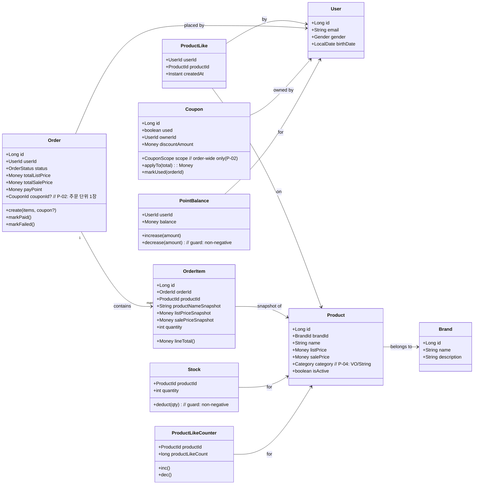

### ERD 

```mermaid
classDiagram
  direction LR

  class User {
    +Long id
    +String email
    +Gender gender
    +LocalDate birthDate
  }

  class Brand {
    +Long id
    +String name
    +String description
  }

  class Product {
    +Long id
    +BrandId brandId
    +String name
    +Money listPrice
    +Money salePrice
    +Category category  // P-04: VO/String
    +boolean isActive
  }

  class ProductLike {
    +UserId userId
    +ProductId productId
    +Instant createdAt
  }

  class Order {
    +Long id
    +UserId userId
    +OrderStatus status
    +Money totalListPrice
    +Money totalSalePrice
    +Money payPoint
    +CouponId couponId? // P-02: 주문 단위 1장
    +create(items, coupon?)
    +markPaid()
    +markFailed()
  }

  class OrderItem {
    +Long id
    +OrderId orderId
    +ProductId productId
    +String productNameSnapshot
    +Money listPriceSnapshot
    +Money salePriceSnapshot
    +int quantity
    +Money lineTotal()
  }

  class Coupon {
    +Long id
    +boolean used
    +UserId ownerId
    +Money discountAmount
    +CouponScope scope  // order-wide only (P-02)
    +applyTo(total): Money
    +markUsed(orderId)
  }

  class PointBalance {
    +UserId userId
    +Money balance
    +increase(amount)
    +decrease(amount)  // guard: non-negative
  }

  class Stock {
    +ProductId productId
    +int quantity
    +deduct(qty)  // guard: non-negative
  }

  class ProductLikeCounter {
    +ProductId productId
    +long productLikeCount
    +inc()
    +dec()
  }

  %% Relations
  Product --> Brand : belongs to
  ProductLike --> User : by
  ProductLike --> Product : on
  Order "1" --> "many" OrderItem : contains
  Order --> User : placed by
  OrderItem --> Product : snapshot of
  Coupon --> User : owned by
  PointBalance --> User : for
  Stock --> Product : for
  ProductLikeCounter --> Product : for

```