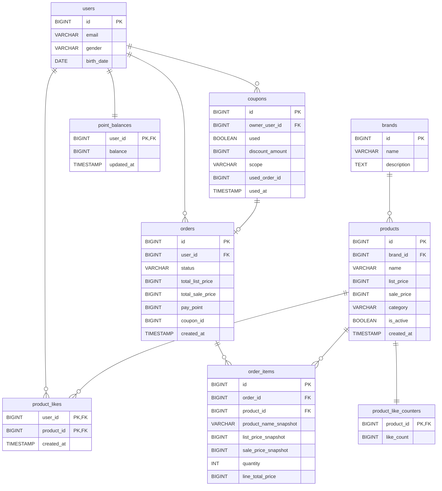

```mermaid
erDiagram
  users {
    BIGINT id PK
    VARCHAR email
    VARCHAR gender
    DATE birth_date
  }

  brands {
    BIGINT id PK
    VARCHAR name
    TEXT description
  }

  products {
    BIGINT id PK
    BIGINT brand_id FK
    VARCHAR name
    BIGINT list_price
    BIGINT sale_price
    VARCHAR category
    BOOLEAN is_active
    TIMESTAMP created_at
  }

  product_likes {
    BIGINT user_id PK, FK
    BIGINT product_id PK, FK
    TIMESTAMP created_at
  }

  product_like_counters {
    BIGINT product_id PK, FK
    BIGINT like_count
  }

  point_balances {
    BIGINT user_id PK, FK
    BIGINT balance
    TIMESTAMP updated_at
  }

  coupons {
    BIGINT id PK
    BIGINT owner_user_id FK
    BOOLEAN used
    BIGINT discount_amount
    VARCHAR scope
    BIGINT used_order_id
    TIMESTAMP used_at
  }

  orders {
    BIGINT id PK
    BIGINT user_id FK
    VARCHAR status
    BIGINT total_list_price
    BIGINT total_sale_price
    BIGINT pay_point
    BIGINT coupon_id
    TIMESTAMP created_at
  }

  order_items {
    BIGINT id PK
    BIGINT order_id FK
    BIGINT product_id FK
    VARCHAR product_name_snapshot
    BIGINT list_price_snapshot
    BIGINT sale_price_snapshot
    INT quantity
    BIGINT line_total_price
  }

  users ||--o{ product_likes : ""
  products ||--o{ product_likes : ""
  brands ||--o{ products : ""
  products ||--|| product_like_counters : ""
  users ||--|| point_balances : ""
  users ||--o{ coupons : ""
  users ||--o{ orders : ""
  orders ||--o{ order_items : ""
  products ||--o{ order_items : ""
  coupons ||--o| orders : ""

```